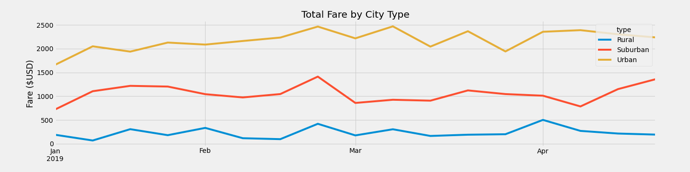
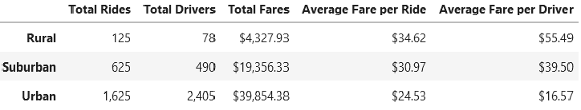

# PyBer_Analysis
Analysis of ride-sharing data gathered from a wide-variety of cities that includes data such as drivers in each city, the city type, and fares collected.

## Results

These results showcase that Urban cities make the most money for the company, as the greatly increased volume of ridership in those places offsets the lower average cost per ride compared to Suburban and Rural cities.

## Summary

Based upon the results of this project there are three recommendations that I can make for addressing disparity among city types:

1. Focus growth on Suburban cities. From this analysis it appears that the most potential to increase ridership comes from these locations. The higher fares associated with these areas combined with increased ridership could lead to Suburban cities rivalling Urban cities total income.
2. Maintain current practices in Urban cities. What is being done currently is working, nothing drastic should be done and the business should focus on slow, consistent growth in these areas.
3. Rural cities are a difficult area to address and would need further evaluation to come up with a proper plan for growth. Low ridership currently could be attributed to multiple factors including high fares, lower population density, fewer drivers, and more.
